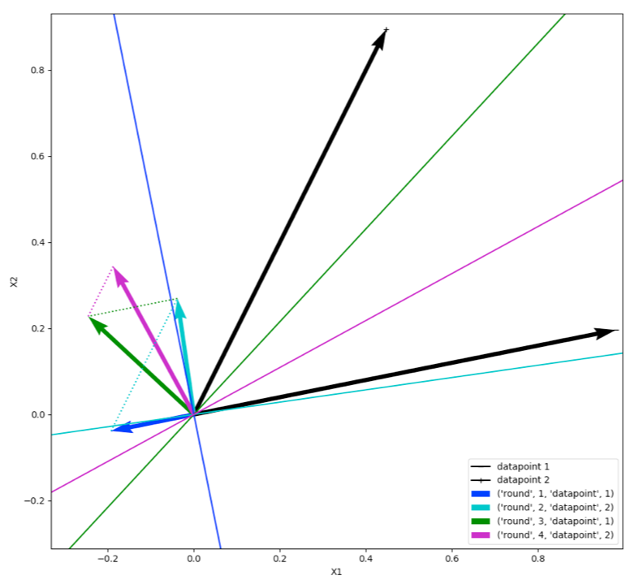

# PAC
Material concerning Passive Aggressive Classifier (PAC)

This is an attempt to get through the math shown in
http://jmlr.csail.mit.edu/papers/volume7/crammer06a/crammer06a.pdf step by step.

File 'SimplePACImplementation191125.py' shows a static implementation of how PAC calculates an optimal margin for 2 data points.

The following tries to show step by step the modification of weight vector  using loss function  . 
Given:

 and:

 
Use Lagrange multipliers to get: 

 

 

 
<a href="https://www.codecogs.com/eqnedit.php?latex=\\&space;\nabla\emph{L}(\overrightarrow{w},\tau)=\nabla&space;f(\overrightarrow{w})&space;-&space;\tau&space;\cdot&space;\nabla&space;g(\overrightarrow{w})&space;=&space;0&space;\\&space;\frac{\partial}{\partial&space;\overrightarrow{w}}\emph{L}(\overrightarrow{w},\tau)=\overrightarrow{w}-\overrightarrow{w_t}-\tau&space;\cdot&space;y_t&space;\cdot&space;\overrightarrow{x_t}=0&space;\\&space;\frac{\partial}{\partial&space;\tau}\emph{L}(\overrightarrow{w},\tau)=&space;-y_t&space;\cdot&space;(\overrightarrow{w}&space;\cdot&space;\overrightarrow{x_t})&space;&plus;&space;1=0&space;\\&space;\\&space;\overrightarrow{w}&space;=&space;\frac{1}{y_t&space;\cdot&space;\overrightarrow{x_t}}&space;\;&space;\;&space;\;&space;\;&space;\;&space;\;&space;\tau&space;=&space;\frac{\overrightarrow{w}-\overrightarrow{w_t}}{y_t&space;\cdot&space;\overrightarrow{x_t}}" target="_blank"></a>
 
<a href="https://www.codecogs.com/eqnedit.php?latex=\\&space;\tau_t&space;=&space;\frac{\frac{1}{y_t&space;\cdot&space;\overrightarrow{x_t}}-\overrightarrow{w_t}&space;}{y_t&space;\cdot&space;\overrightarrow{x_t}}&space;=&space;\frac{\frac{1-y_t&space;\cdot(\overrightarrow{w_t}&space;\cdot&space;\overrightarrow{x_t})}{y_t&space;\cdot&space;\overrightarrow{x_t}}}{y_t&space;\cdot&space;\overrightarrow{x_t}}&space;=&space;\frac{1-y_t&space;\cdot(\overrightarrow{w_t}&space;\cdot&space;\overrightarrow{x_t})}{y_t&space;\cdot&space;y_t&space;\cdot&space;\overrightarrow{x_t}&space;\cdot&space;\overrightarrow{x_t}}=&space;\frac{\mathit{l_t}(\overrightarrow{w_t};(\overrightarrow{x_t},y_t))}{\left&space;\|&space;x_t&space;\right&space;\|^2}&space;=&space;\frac{\mathit{l_t}}{\left&space;\|&space;x_t&space;\right&space;\|^2}" target="_blank"></a>
 

 Geometrically this is a vector projection of 

onto the halfspace of vectors at time t with hinge-loss of 0.
 Mind:
 
 and:
 

 
<a href="https://www.codecogs.com/eqnedit.php?latex=\\&space;\tau_t&space;=&space;0:&space;\overrightarrow{w}_{t&plus;1}&space;=&space;\overrightarrow{w}_{t}&space;\\&space;\tau_t&space;\neq&space;0:&space;\overrightarrow{w}_{t&plus;1}&space;=&space;\overrightarrow{w}_{t}&space;&plus;&space;\tau_t&space;\cdot&space;y_t&space;\cdot&space;\overrightarrow{x}_{t}&space;=\overrightarrow{w}_{t}&space;&plus;&space;\frac{(1-y_t&space;\cdot(\overrightarrow{w}_t&space;\cdot&space;\overrightarrow{x}_t))}{\left&space;\|&space;\overrightarrow{x}_t&space;\right&space;\|^2}\cdot&space;y_t&space;\cdot&space;\overrightarrow{x}_t&space;\\&space;\text{\;&space;\;&space;\;\;&space;\;&space;\;&space;\;&space;\;&space;\;\:&space;\:}=\overrightarrow{w}_t&plus;&space;\frac{y_t&space;\cdot&space;\overrightarrow{x}_t}{\left&space;\|&space;\overrightarrow{x}_t&space;\right&space;\|^2}-{\color{Red}&space;\frac{(\overrightarrow{w}_t&space;\cdot&space;\overrightarrow{x}_t)}{\left&space;\|&space;\overrightarrow{x}_t&space;\right&space;\|}&space;\cdot&space;\frac{\overrightarrow{x}_t}{\left&space;\|&space;\overrightarrow{x}_t&space;\right&space;\|}}&space;\\&space;{\color{Red}&space;\text{\;&space;\;&space;\;&space;\;&space;\;&space;\;&space;\;&space;\;&space;\;&space;\;&space;\;&space;\;&space;\;&space;\;&space;\;&space;\;&space;\;&space;\;&space;\:&space;\:&space;Vector&space;Projection}\overrightarrow{w}_t&space;\text{&space;to&space;}&space;\overrightarrow{x}_t}" target="_blank"></a>
 
Example:
 
<a href="https://www.codecogs.com/eqnedit.php?latex=\\&space;\overrightarrow{w}_{t&plus;1}&space;=\overrightarrow{w}_t&plus;&space;\frac{y_t&space;\cdot&space;\overrightarrow{x}_t}{\left&space;\|&space;\overrightarrow{x}_t&space;\right&space;\|^2}-(\overrightarrow{w}_t&space;\cdot&space;\frac{&space;\overrightarrow{x}_t}{\left&space;\|&space;\overrightarrow{x}_t&space;\right&space;\|})&space;\cdot&space;\frac{\overrightarrow&space;{x}_t}{\left&space;\|&space;\overrightarrow{x}_t&space;\right&space;\|}&space;\\&space;\text{for&space;}&space;\overrightarrow{w}_0=\binom{0}{0}&space;\\&space;\overrightarrow{w}_1=\overrightarrow{w}_0&plus;\frac{y_t&space;\cdot&space;\overrightarrow{x}_t}{\left&space;\|&space;\overrightarrow{x}_t&space;\right&space;\|^2}&space;\\&space;\text{Vector&space;Projection&space;=&space;0}&space;\\&space;\text{check&space;round&space;1,&space;datapoint&space;1&space;in&space;'SimplePACImplementation191125.py'}" target="_blank"></a>
 

 
It's by far not complete, so anybody who wants to contribute or correct things is more than welcome.

Further material to this subject can be found here: 

https://papers.nips.cc/paper/2360-online-passive-aggressive-algorithms.pdf

https://www.youtube.com/watch?v=O0a-m2d_L58  

https://www.youtube.com/watch?v=uxGDwyPWNkU

https://www.youtube.com/watch?v=TJU8NfDdqNQ

https://link.springer.com/chapter/10.1007/978-3-642-53917-6_32

https://arxiv.org/pdf/1808.06107.pdf

https://www.bonaccorso.eu/2017/10/06/ml-algorithms-addendum-passive-aggressive-algorithms/

https://link.springer.com/chapter/10.1007/978-3-642-41491-6_12

https://scikit-learn.org/stable/modules/generated/sklearn.linear_model.PassiveAggressiveClassifier.html
